# Docker Log Summariser MCP – Technical Architecture

## Overview
The architecture focuses on a lightweight Node.js service that tails Docker container logs, chunks them into manageable blobs, routes each chunk through Gemini for summarisation, and stores results for fast querying via CLI or REST.

## Component Diagram

```mermaid
graph TD
    subgraph "Host Machine"
        LC["📝 Log Collector (Node.js + dockerode)"]
        CH["🔗 Chunker & Pre-Processor"]
        SUM["🧠 Gemini Summariser Worker"]
        DB[("📦 SQLite / Postgres – Summaries & Metadata")]
        API["🌐 Query API (Fastify & yargs CLI)"]
    end
    UserCLI["💻 CLI / MCP Client"]
    DockerEngine["🐳 Docker Engine"]

    DockerEngine -->|"docker SDK stream"| LC
    LC --> CH
    CH -->|"JSON chunk"| SUM
    SUM -->|"summary + metrics"| DB
    API --> DB
    UserCLI <-->|"REST / CLI"| API
    UserCLI -->|"Follow-up Qs"| SUM
```


## Component Descriptions
| ID | Component | Responsibilities |
|----|-----------|------------------|
| LC | **Log Collector** | Attaches to selected containers using dockerode; streams _stdout_ & _stderr_; handles restart & rotation; pushes raw lines to Chunker. |
| CH | **Chunker / Pre-Processor** | Buffers lines; strips ANSI; redacts secrets; emits chunk every 30 s or when size > 8 KB. |
| SUM | **Gemini Summariser Worker** | Consumes chunks; sends prompt to Gemini; records summary, token usage, cost; retries with back-off. |
| DB | **Persistence Layer** | SQLite (file) by default; Postgres via SQLAlchemy for multi-node; full-text search on summaries. |
| API | **Query Interface** | Fastify REST plus yargs CLI wrapper; endpoints: `/summaries`, `/chunks/{id}`, `/ask`; secures via JWT. |
| UserCLI | **User Client / MCP** | Human or programmatic caller; browses summaries, runs follow-up questions. |

## Technology Stack
* **Language / Runtime:** Node.js 20 LTS, native async/await.
* **Docker SDK:** `dockerode` for log streaming with Promise-based API.
* **Web / CLI:** Fastify for REST; yargs for CLI commands sharing same service layer.
* **Database:** better-sqlite3 (MVP) → pg (PostgreSQL) option; Prisma ORM; SQLite FTS5 for full-text search.
* **LLM:** Google Gemini via @google/generative-ai or native fetch; exponential back-off & circuit-breaker wrapper.
* **Observability:** prom-client (`/metrics` endpoint); structured logs (winston or pino).

## Data Flow
1. Docker Engine emits logs → Log Collector reads via socket.
2. Collector forwards raw lines to Chunker.
3. Chunker buffers & cleans → emits chunk event.
4. Summariser sends chunk to Gemini → receives summary.
5. Summary & metadata persisted in DB; optional raw chunk stored compressed on disk.
6. Query API serves summaries; can fetch raw chunk for follow-up Q&A.

## Persistence Schema (logical)
```text
chunks (
  id PK, container TEXT, ts_start TIMESTAMP, ts_end TIMESTAMP,
  raw_path TEXT, size_bytes INT
)

summaries (
  id PK, chunk_id FK, summary TEXT,
  tokens_in INT, tokens_out INT, cost_usd NUMERIC,
  created_at TIMESTAMP DEFAULT now()
)
```

## Security & Error Handling
* Docker socket mounted **read-only**.
* Secrets redaction regex list configurable; executed before Gemini call.
* Gemini 429/5xx → exponential back-off (1 → 32 s) then circuit-break 5 min.
* JWT-based auth middleware on REST; CLI can use `--token` or env var.
* Graceful SIGTERM: drains buffers, flushes DB, closes Gemini sessions.

## Deployment
* Single binary via `pkg` or Docker image; systemd unit or Docker sidecar (`--pid=host --volumes=/var/run/docker.sock:ro`).
* Helm chart planned for Kubernetes environments.

## Future Extensions
* Vector embeddings for semantic search.
* Multi-language summarisation.
* Web UI dashboard with realtime stream.

---
© 2025 