# Docker Log Summariser MCP – Technical Architecture

## Overview
The architecture focuses on a lightweight Node.js service that processes logs from multiple sources (Docker containers, files, URLs), chunks them into manageable blobs, routes each chunk through Gemini for summarisation, and stores results for fast querying via CLI or REST API.

## Component Diagram

```mermaid
graph TD
    subgraph "Host Machine"
        LC["📝 Log Collector (Node.js + dockerode)"]
        FS["📄 File Source Reader"]
        US["🌐 URL Source Reader"]
        CH["🔗 Chunker & Pre-Processor"]
        SUM["🧠 Gemini Summariser Worker"]
        DB[("📦 SQLite – Summaries & Metadata")]
        API["🌐 Query API (Fastify)"]
        CLI["💻 CLI Wrapper (yargs)"]
        METRICS["📊 Prometheus Metrics"]
    end
    UserCLI["💻 User CLI"]
    UserAPI["🔌 API Client"]
    DockerEngine["🐳 Docker Engine"]
    LogFiles["📄 Log Files"]
    LogURLs["🌐 Log URLs"]

    DockerEngine -->|"docker SDK stream"| LC
    LogFiles -->|"file watch / tail"| FS
    LogURLs -->|"HTTP fetch"| US
    LC --> CH
    FS --> CH
    US --> CH
    CH -->|"JSON chunk"| SUM
    SUM -->|"summary + metrics"| DB
    API --> DB
    CLI --> API
    UserCLI <-->|"CLI commands"| CLI
    UserAPI <-->|"REST calls"| API
    API -->|"follow-up Q&A"| SUM
    METRICS -->|"/metrics endpoint"| API
```


## Component Descriptions
| ID | Component | Responsibilities |
|----|-----------|------------------|
| LC | **Log Collector** | Attaches to selected containers using dockerode; streams _stdout_ & _stderr_; handles restart & rotation; pushes raw lines to Chunker. |
| FS | **File Source Reader** | Reads local log files with optional tailing (`-f`) support; handles log rotation; feeds lines to Chunker. |
| US | **URL Source Reader** | Fetches logs from HTTP(S) URLs with gzip support and Range resume capability; feeds lines to Chunker. |
| CH | **Chunker / Pre-Processor** | Buffers lines; strips ANSI; redacts secrets; emits chunk every 30 s or when size > 8 KB; increments Prometheus counters. |
| SUM | **Gemini Summariser Worker** | Consumes chunks; sends prompt to Gemini; records summary, token usage, cost; retries with exponential back-off. |
| DB | **Persistence Layer** | SQLite with better-sqlite3; stores chunks, summaries, and Q&A sessions; optimized prepared statements. |
| API | **Query Interface** | Fastify REST server; endpoints: `/summaries`, `/chunks/{id}`, `/ask`, `/metrics`; JWT authentication middleware. |
| CLI | **CLI Wrapper** | yargs-based command-line interface; commands: `list`, `show`, `ask`; connects to API via REST. |
| METRICS | **Observability** | Prometheus metrics including log_lines_total, collector_source_errors_total, Gemini latency/cost tracking. |

## Technology Stack
* **Language / Runtime:** Node.js 22 LTS, native async/await, ES modules.
* **Docker SDK:** `dockerode` for log streaming with Promise-based API.
* **Web / CLI:** Fastify for REST API with OpenAPI/Swagger docs; yargs for CLI commands.
* **Database:** better-sqlite3 for SQLite with prepared statements and transactions.
* **LLM:** Google Gemini via @google/generative-ai; exponential back-off & retry logic.
* **Authentication:** JWT middleware with configurable secret.
* **File I/O:** Node.js fs/readline for file tailing and URL fetching with node-fetch.
* **Observability:** prom-client for Prometheus metrics; structured logging with custom logger.
* **Testing:** Vitest for unit and integration tests; coverage reporting.
* **Deployment:** Helm chart included for Kubernetes deployments.

## Data Flow
1. **Source Input:** Docker Engine, log files, or URLs emit logs → respective source readers capture them.
2. **Processing:** Source readers forward raw lines to Chunker with incremented line counters.
3. **Chunking:** Chunker buffers, cleans, and redacts → emits chunk events every 30s or 8KB.
4. **Summarisation:** Summariser sends chunk to Gemini → receives summary with retry logic.
5. **Persistence:** Summary, metadata, and Q&A stored in SQLite with optimized schema.
6. **Querying:** REST API serves summaries, chunks, and handles follow-up questions with JWT auth.
7. **CLI Access:** Command-line wrapper provides user-friendly interface to API functionality.

## Persistence Schema (implemented)
```sql
-- Chunks table
CREATE TABLE chunks (
  id INTEGER PRIMARY KEY AUTOINCREMENT,
  container TEXT NOT NULL,
  ts_start TEXT NOT NULL,
  ts_end TEXT NOT NULL,
  content TEXT NOT NULL,
  created_at TEXT DEFAULT (datetime('now'))
);

-- Summaries table  
CREATE TABLE summaries (
  id INTEGER PRIMARY KEY AUTOINCREMENT,
  chunk_id INTEGER NOT NULL,
  summary TEXT NOT NULL,
  tokens_input INTEGER NOT NULL,
  tokens_output INTEGER NOT NULL,
  cost_usd REAL NOT NULL,
  created_at TEXT DEFAULT (datetime('now')),
  FOREIGN KEY (chunk_id) REFERENCES chunks(id)
);

-- Q&A sessions table
CREATE TABLE qa_sessions (
  id INTEGER PRIMARY KEY AUTOINCREMENT,
  chunk_id INTEGER,
  question TEXT NOT NULL,
  answer TEXT NOT NULL,
  created_at TEXT DEFAULT (datetime('now')),
  FOREIGN KEY (chunk_id) REFERENCES chunks(id)
);
```

## Security & Error Handling
* **Docker Access:** Docker socket mounted **read-only** for container log access.
* **Secret Redaction:** Configurable regex patterns redact sensitive data before LLM calls.
* **API Security:** JWT-based authentication middleware on all protected endpoints.
* **Error Resilience:** Gemini 429/5xx → exponential back-off (1s → 32s) with circuit breaker.
* **Source Error Tracking:** Prometheus counter `collector_source_errors_total{source_type}` for monitoring.
* **Graceful Shutdown:** SIGTERM handler drains buffers, flushes DB, closes connections.

## Performance Benchmarks
**File Ingestion Performance (validated):**
* **Throughput:** 142,061 lines/sec
* **Latency:** 0.007 ms average processing time per line
* **Target Compliance:** ✅ Sub-millisecond processing (35x better than 0.25ms target)

## Deployment
* **Development:** Direct Node.js execution with npm scripts
* **Production:** Docker container with multi-stage build
* **Kubernetes:** Helm chart with configurable values for scaling and resource limits
* **CLI Distribution:** Standalone executable via binary packaging

## API Endpoints (implemented)
* `GET /health` - Health check endpoint
* `GET /metrics` - Prometheus metrics exposure
* `GET /summaries` - List summaries with optional filters (container, time range)
* `GET /chunks/:id` - Retrieve raw chunk content by ID
* `POST /ask` - Submit follow-up questions with optional chunk context
* `GET /docs` - Interactive OpenAPI/Swagger documentation

## Future Extensions
* **Vector Embeddings:** Semantic search across summaries using embeddings
* **Multi-language Support:** Summarisation in languages other than English  
* **Web Dashboard:** Real-time streaming UI with charts and alerts
* **Advanced Analytics:** Trend analysis and anomaly detection
* **Multi-node Deployment:** PostgreSQL backend for distributed setups

---
© 2025 