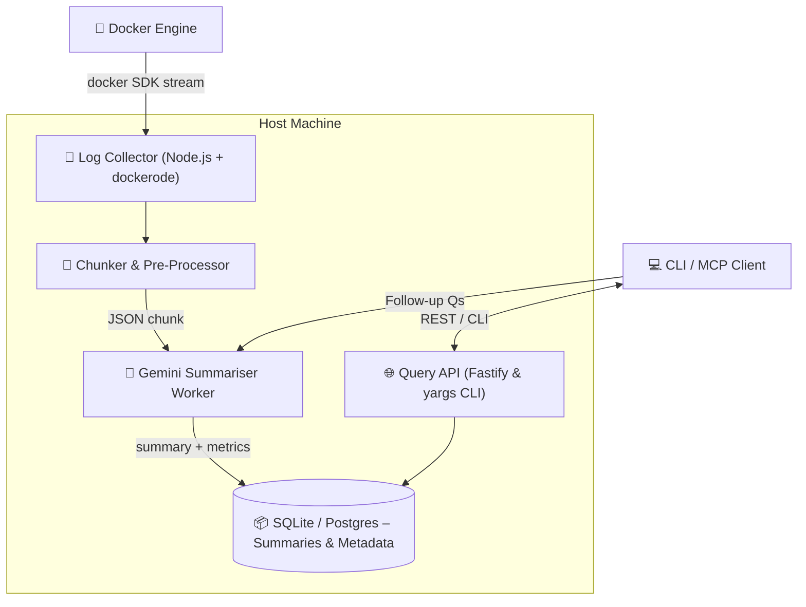

# Component Diagram

```mermaid
graph TD
    subgraph "Host Machine"
        LC["📝 Log Collector (Node.js + dockerode)"]
        CH["🔗 Chunker & Pre-Processor"]
        SUM["🧠 Gemini Summariser Worker"]
        DB[("📦 SQLite / Postgres – Summaries & Metadata")]
        API["🌐 Query API (Fastify & yargs CLI)"]
    end
    UserCLI["💻 CLI / MCP Client"]
    DockerEngine["🐳 Docker Engine"]

    DockerEngine -->|"docker SDK stream"| LC
    LC --> CH
    CH -->|"JSON chunk"| SUM
    SUM -->|"summary + metrics"| DB
    API --> DB
    UserCLI <-->|"REST / CLI"| API
    UserCLI -->|"Follow-up Qs"| SUM
```
