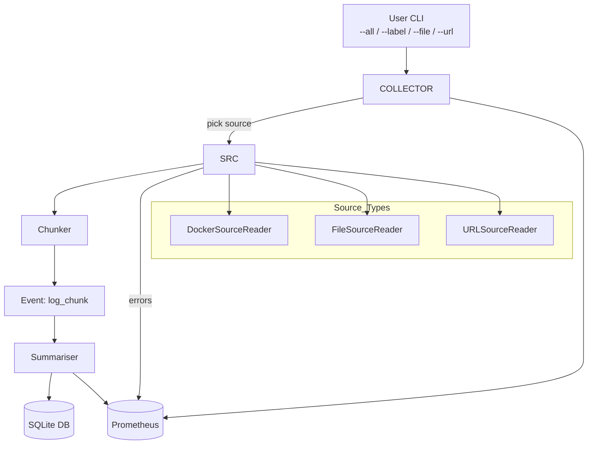

# File & URL Log Source – Architecture Note (Story 1.4)

## 1 | Objective
Extend the Log Collector so it can ingest log lines from:

* **File** – `--file <path>` (with optional `--follow` for tail-ing & rotation)
* **HTTP(S) URL** – `--url <https://…>` (supports gzip, Range resume)

This broadens use-cases beyond live Docker containers, enabling retrospective analysis of archives or remote hosts while preserving the existing summarisation pipeline.

---

## 2 | Current State (Pre-Story 1.4)
`DockerSourceReader → Chunker → Summariser → SQLite / Prometheus`

The Collector is tightly coupled to Docker streams.

---

## 3 | Proposed Design

### 3.1  AbstractSourceReader
```ts
interface AbstractSourceReader extends EventEmitter {
  start(): Promise<void>;   // begin emitting `line` events
  stop():  Promise<void>;   // graceful shutdown
  // events: line, error, end
}
```
Provides a common contract for all input sources.

### 3.2  Concrete Implementations
1. **DockerSourceReader** (✓ refactor of current code)  
2. **FileSourceReader** – `fs.createReadStream` → `readline`  
   • Handles `--follow`; detects inode changes to survive rotation.  
3. **URLSourceReader** – `undici.stream` (+ `zlib` gunzip)  
   • Retries & resumes via HTTP `Range` on failure.

### 3.3  Collector Orchestration
* CLI mutually-exclusive groups: `{--all|--label}` vs `{--file|--url}`.  
* Collector selects the appropriate SourceReader, pipes its `line` events into **Chunker** (unchanged).

### 3.4  Metadata Changes
Replace `container_id` with a generic `source_id`:
```
file:/abs/path/app.log
docker:87f3…
url:https://…/archive.gz
```

### 3.5  Metrics
* Label all existing counters/histograms with `source_type={docker|file|url}`.  
* New counter `collector_source_errors_total{source_type}` increments on I/O or network errors.

### 3.6  Error & Resiliency
Errors bubble to Collector; its circuit-breaker logic throttles the Summariser when upstream failures spike. URL retries use exponential back-off aligned with Gemini client strategy.

---

## 4 | Data-Flow Diagram


---

## 5 | Trade-offs & Alternatives
| Option | Pros | Cons |
|--------|------|------|
| **Single monolithic Collector with switch** | Simpler CLI; no IPC | Collector risk surface grows; harder to test each source in isolation |
| Separate micro-services per source | Clear separation, independent scaling | More deployment complexity; coordination overhead |
| Kafka ingestion pipeline | Unified, durable log bus | Adds infra; overkill for local-first MCP |

Chosen: **Monolithic Collector with pluggable SourceReaders** to minimise surface area change and keep deployment simple.

---

## 6 | Performance Targets
* Maintain **P95 chunk latency < 250 ms** at 2 000 lps from FileSourceReader.
* CPU utilisation ≤ 5 % on dev laptop (M2 / 8-core) during ingest & summarise.

---

## 7 | Security & Compliance
* Existing secret-redaction regex reused.  
* URL ingestion downloads only `https` by default; explicit `--insecure-http` flag would be needed to allow `http://`.
* File path resolved to absolute; symlink traversal prevented via `fs.realpathSync`.

---

## 8 | Open Questions
1. Should we support cloud object stores (S3, GCS) as future sources?  
2. Do we need rate-limiting for large file ingestion to avoid token surges to Gemini?

---

## 9 | References
* Story 1.4 document – `docs/stories/1.4.collector-file-url-source.md`  
* Component diagram – `docs/architecture-docker-mcp/component-diagram.md` 