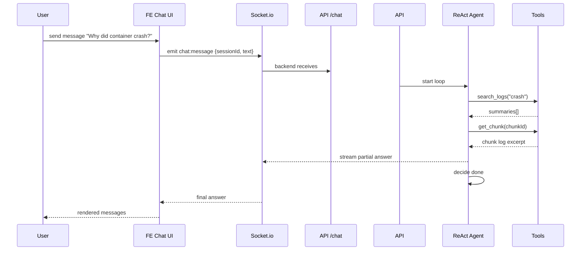

# Design Document: ReAct Chat for Ask Feature (US-003)

## Overview
Transform the existing single-turn “Ask” endpoint/UI into a multi-turn chat powered by a ReAct (Reasoning + Acting) agent. The agent will plan, call internal tools (search logs, fetch chunk, etc.), observe results, and generate responses iteratively.

## Goals & Success Criteria
- Chat UI with persistent message history per session.
- Streaming / near real-time responses.
- Agent can autonomously pull additional context if initial answer is uncertain.
- Easy to extend with new tools (e.g., `list_containers`).

## Key Architectural Decisions
| Area | Choice |
|------|--------|
| **Transport** | WebSockets (Socket.io) for bi-directional updates; fallback to HTTP long-polling. |
| **State Mgmt (FE)** | Zustand store `useChatStore` to hold messages, current sessionId. |
| **Session Storage (BE)** | `chats` table (id, title, messages JSON, created_at). |
| **Agent Pattern** | Custom lightweight ReAct loop inside `src/qa.js` (no external LangChain dep for now). |
| **Tools** | 1) `search_logs(query)` → vectorSearch; 2) `get_chunk(id)` → db.getChunk; 3) `get_summary(id)`; 4) `report(answer)` terminates loop. |

## Sequence Diagram


## Backend Changes
1. **WebSocket Gateway**
   - Use `socket.io` in `src/api.js`: `io.on('connection', socket => …)`.
   - Namespace `/chat`.
2. **Chat Controller**
   - `src/chat.js` new module: orchestrates ReAct agent per socket.
3. **ReAct Loop (inside qa.js or new react_agent.js)**
   ```js
   while (step < MAX_STEPS) {
     const thought = think(history);
     const { tool, args } = decideTool(thought);
     const observation = await invokeTool(tool, args);
     history.push({ tool, args, observation });
     if (tool === 'report') break; // final answer
   }
   ```
4. **Data Persistence**
   - Extend DB schema: `CREATE TABLE IF NOT EXISTS chats (id INTEGER PK, title TEXT, messages JSON, created_at TIMESTAMP)`.
   - Save after each user/assistant turn.

## Frontend Changes
- New page `website/src/app/dashboard/ask/page.tsx`
  - Chat pane, messages list, input box.
  - On submit → `socket.emit('chat:message', …)`.
  - Listen on `socket.on('chat:response', …)` to append assistant messages (stream chunks if desired).
- Zustand store example:
```ts
import create from 'zustand';
export const useChatStore = create((set)=>({
  sessionId: null,
  messages: [],
  addMessage: (m)=>set((s)=>({...s, messages:[...s.messages, m]}))
}));
```

## Edge Cases & Error Handling
- **LM Timeout**: Send “Still thinking…” placeholder; allow cancel.
- **No Relevant Logs**: Agent replies “Need more context” and suggests user provide timeframe/filter.
- **Rate Limits**: Queue or throttle outgoing LM calls per session.

## Security Considerations
- Sanitize user inputs before tool invocation.
- Limit max token usage per message to control cost.
- WebSocket auth: Send JWT in connection query, verify before joining room.

## Risks & Mitigations
- **Complexity of ReAct**: Keep loop bounded (max 4 steps); log every action for debugging.
- **Cost Spikes**: Track token/cost metrics per chat; enforce quotas.

## Minimal Path & Library Choices
- **Transport**: Socket.io v4 for WebSocket layer (simple API, well-maintained).
- **State (FE)**: Zustand for chat store (few lines, avoids Redux).
- **Data caching**: TanStack Query v5 for initial chats list/history fetch.
- **Backend**: keep better-sqlite3; no ORM. Socket.io namespace `/chat` integrated into existing Fastify instance via `fastify-socket.io`.
- **Agent**: custom ReAct loop in plain JS (no LangChain) with internal tool registry.
- **Streaming**: emit incremental `chat:token` events rather than fancy SSE.
- **Styling**: Tailwind + Headless UI `<Listbox>` for chat selector (if needed).
- **Testing**: Vitest for agent loop, Playwright for chat UI.

---

## Estimated Effort
6–8 dev hours (split: 2 FE, 4 BE, 1 buffer).

## Acceptance Test Checklist
- [ ] Multi-turn chat works; messages persist on refresh.
- [ ] Agent fetches additional context (verify via logs).
- [ ] Streaming responses displayed smoothly.
- [ ] WebSocket disconnect/reconnect resumes session. 