# Website UX Architecture

This document outlines the high-level site architecture and user journeys for the Docker Log Summariser MCP website.

## High-Level Site Map

```mermaid
graph TD
    A[🏠 Home / Landing Page] --> B{🎯 Choose Your Role};
    
    B --> C[👨‍💻 Developer];
    B --> D[🔧 DevOps Engineer];
    B --> E[👔 Manager];
    
    subgraph Developer Journey
        C --> C1[🟢 **Quick Start:**<br/>5-Min Setup];
        C1 --> C2[🟡 **Core Skills:**<br/>Production Deployment];
        C2 --> C3[🔴 **Advanced:**<br/>API & Customization];
    end
    
    subgraph DevOps Journey
        D --> D1[🟢 **Quick Start:**<br/>Monitor One Container];
        D1 --> D2[🟡 **Core Skills:**<br/>Kubernetes & Monitoring];
        D2 --> D3[🔴 **Advanced:**<br/>Scaling & Security];
    end
    
    subgraph Manager Journey
        E --> E1[📊 **The Value:**<br/>ROI & Use Cases];
        E1 --> E2[📈 **Case Studies:**<br/>Real-World Impact];
        E2 --> E3[📋 **Adoption Guide:**<br/>Team Rollout Plan];
    end

    F[📚 Docs]
    G[🌐 Blog]
    H[🤝 Community]

    C3 --> F;
    D3 --> F;
    E3 --> H;
```

## UX Principles

1.  **Role-Based Entry:** The homepage immediately directs users to the content most relevant to them.
2.  **Progressive Disclosure:** Each role has a clear learning path (Easy → Standard → Advanced) to prevent overwhelm.
3.  **Action-Oriented Navigation:** Navigation uses compelling, action-oriented titles to guide the user. 